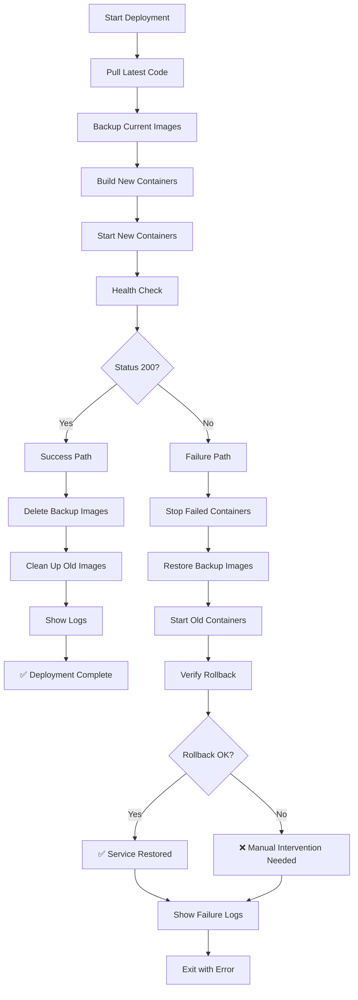

# Automatic Rollback Feature

## ✅ Overview

The GitHub Actions deployment workflow now includes **automatic rollback** capabilities. If a deployment fails health checks, the system automatically restores the previous working version.

---

## 🔄 How It Works

### Deployment Flow



---

## 📝 Step-by-Step Process

### 1. **Pre-Deployment Backup**
```bash
# Before deploying, tag current images with :backup
docker tag algopattern-backend:latest algopattern-backend:backup
docker tag algopattern-worker:latest algopattern-worker:backup
```

### 2. **Deploy New Version**
```bash
# Build and start new containers
docker-compose -f docker-compose.prod.yml up -d --build
```

### 3. **Health Check** (15 seconds wait)
```bash
# Test if new deployment is healthy
curl http://localhost:3000/health
```

### 4a. **Success Path** (Health Check = 200)
```bash
# Clean up backup images
docker image rm algopattern-backend:backup
docker image rm algopattern-worker:backup
docker image prune -f
```

### 4b. **Failure Path** (Health Check ≠ 200)
```bash
# Stop failed deployment
docker-compose -f docker-compose.prod.yml down

# Restore backup
docker tag algopattern-backend:backup algopattern-backend:latest
docker tag algopattern-worker:backup algopattern-worker:latest

# Start old version
docker-compose -f docker-compose.prod.yml up -d

# Verify rollback worked
curl http://localhost:3000/health
```

---

## 🧪 Testing the Rollback

### Simulate a Failed Deployment

```bash
# 1. SSH into your server
ssh -i YOUR_KEY root@YOUR_IP

cd ~/LeetCode_PRO/backend

# 2. Intentionally break the health endpoint
# Edit src/index.js or any file to cause a startup failure

# 3. Commit and push
git add .
git commit -m "test: simulate deployment failure"
git push origin main

# 4. Watch GitHub Actions logs
# You should see:
# - ❌ Health check failed
# - 🔄 Performing automatic rollback
# - ♻️ Restoring previous version
# - ✅ Rollback successful!

# 5. Verify service is still running with old version
curl http://YOUR_IP:3000/health

# 6. Revert the breaking change
git revert HEAD
git push origin main
```

---

## 📊 Deployment Scenarios

### Scenario 1: Successful Deployment
```
📥 Pull latest code ✅
💾 Backup current images ✅
🐳 Build new containers ✅
🏥 Health check: 200 ✅
🧹 Clean up backups ✅
✅ Deployment complete
```

### Scenario 2: Failed Deployment with Successful Rollback
```
📥 Pull latest code ✅
💾 Backup current images ✅
🐳 Build new containers ✅
🏥 Health check: 500 ❌
🔄 Stop failed containers ✅
♻️ Restore backup ✅
🏥 Rollback verification: 200 ✅
✅ Service restored to previous version
```

### Scenario 3: Failed Deployment AND Failed Rollback
```
📥 Pull latest code ✅
💾 Backup current images ✅ (but no previous images existed)
🐳 Build new containers ✅
🏥 Health check: 500 ❌
🔄 Stop failed containers ✅
♻️ Restore backup ⚠️ (no backup available)
🏥 Rollback verification: Failed ❌
❌ Manual intervention required
```

---

## 🛠️ Troubleshooting

### Issue: "No previous backend image to backup"

**Cause:** This is the first deployment or images were manually deleted.

**Impact:** Rollback won't work for this deployment.

**Solution:** Ensure first deployment is manually tested before pushing to main.

---

### Issue: "Rollback verification failed"

**Cause:** 
- Database migrations are incompatible
- Environment variables changed
- Docker network issues

**Solution:**
```bash
# 1. Check what's failing
docker-compose -f docker-compose.prod.yml logs backend

# 2. Check container status
docker-compose -f docker-compose.prod.yml ps

# 3. Try manual restart
docker-compose -f docker-compose.prod.yml restart backend

# 4. If still failing, restore from known good commit
git checkout LAST_WORKING_COMMIT
docker-compose -f docker-compose.prod.yml down
docker-compose -f docker-compose.prod.yml up -d --build
```

---

### Issue: Rollback works but uses old database schema

**Cause:** New code ran migrations that old code doesn't support.

**Prevention:**
- Always write backward-compatible migrations
- Test rollback scenarios locally
- Consider blue-green deployment for major schema changes

**Solution if it happens:**
```bash
# Revert migrations manually
docker-compose -f docker-compose.prod.yml exec backend npx prisma migrate resolve --rolled-back MIGRATION_NAME
```

---

## 📋 Monitoring Rollback Events

### GitHub Actions Logs

Look for these indicators:

**Successful Rollback:**
```
❌ Health check failed (HTTP 500)
🔄 Performing automatic rollback...
♻️ Restoring previous version...
✅ Rollback successful! Service restored to previous version.
```

**Failed Rollback:**
```
❌ Health check failed (HTTP 500)
🔄 Performing automatic rollback...
♻️ Restoring previous version...
⚠️ No backup to restore
❌ Rollback verification failed! Manual intervention required.
```

---

## 🔐 Important Limitations

### What Rollback CAN Do:
- ✅ Restore previous application code
- ✅ Revert to previous Docker containers
- ✅ Prevent complete service outage
- ✅ Notify about rollback status

### What Rollback CANNOT Do:
- ❌ Revert database migrations automatically
- ❌ Restore deleted data
- ❌ Fix environment configuration issues
- ❌ Recover from Docker host failures

---

## 💡 Best Practices

### 1. **Test Before Deploying**
```bash
# Always test locally first
docker-compose -f docker-compose.prod.yml up -d --build
curl http://localhost:3000/health
```

### 2. **Write Backward-Compatible Migrations**
```javascript
// Good: Add column with default
ALTER TABLE users ADD COLUMN new_field VARCHAR(255) DEFAULT 'value';

// Bad: Remove column (breaks rollback)
ALTER TABLE users DROP COLUMN old_field;
```

### 3. **Monitor Deployments**
- Watch GitHub Actions real-time
- Set up alerts for failed deployments
- Check logs after every deployment

### 4. **Keep Backups**
```bash
# Don't run image prune too aggressively
# Keep at least 2-3 previous images
docker images | grep algopattern
```

---

## 🎯 Configuration

The rollback is configured in `.github/workflows/ci.yml`:

```yaml
# Key configuration points:
- Health check wait time: 15 seconds
- Rollback verification wait: 10 seconds
- Health endpoint: http://localhost:3000/health
- Backup image tags: :backup
```

To adjust:
- **Increase wait times** for slower servers
- **Change health endpoint** if using different path
- **Add retry logic** for flaky health checks

---

## 📈 Success Metrics

Track these to measure rollback effectiveness:

| Metric | Target | How to Measure |
|--------|--------|----------------|
| Rollback Success Rate | >95% | Count successful vs failed rollbacks |
| Downtime During Rollback | <2 minutes | Time between failure and restoration |
| False Positive Rate | <5% | Rollbacks triggered by flaky health checks |
| Manual Intervention | <1/week | Times rollback couldn't auto-recover |

---

## 🔄 Future Enhancements

Potential improvements:

1. **Database Rollback:** Automatic migration reverting
2. **Multi-Stage Health Checks:** Test multiple endpoints
3. **Canary Deployments:** Gradual rollout with auto-rollback
4. **Notification Integration:** Slack/email alerts
5. **Rollback History:** Track all rollback events

---

## Summary

✅ **Automatic rollback is now active!**

Your deployment pipeline will:
1. Always backup before deploying
2. Automatically detect failures via health checks
3. Restore previous version if deployment fails
4. Verify rollback worked correctly
5. Notify about rollback status

This significantly reduces deployment risk and prevents extended downtime! 🎉
